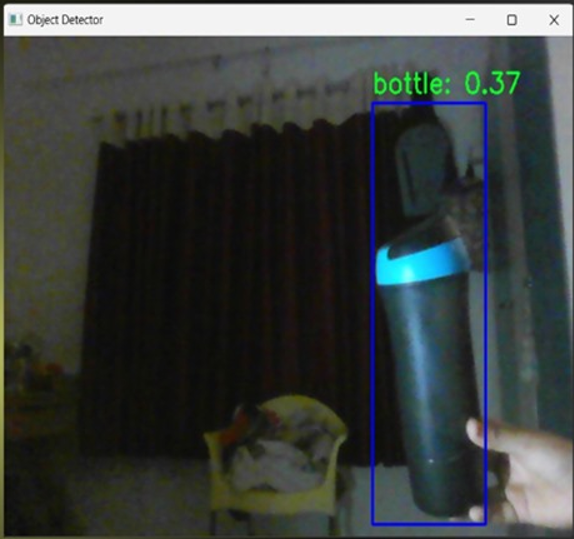

# Real-Time Object Detection for Visually Impaired

This project uses YOLOv5 and AWS Polly to detect objects in real time and provide audio feedback to help visually impaired individuals.

## 📑 Documentation

- [Project Overview](docs/00_overview.md)
- [IAM User Setup](docs/01_awsIAMSetup.md)
- [Access Key Setup](docs/02_accessKeySetup.md)
- [PyCharm Project Setup](docs/03_projectSetupPyCharm.md)
- [Code Execution](docs/04_codeExecution.md)
- [Post Execution Steps](docs/05_postExecution.md)

## 📸 Screenshots

### ✅ Final Output

